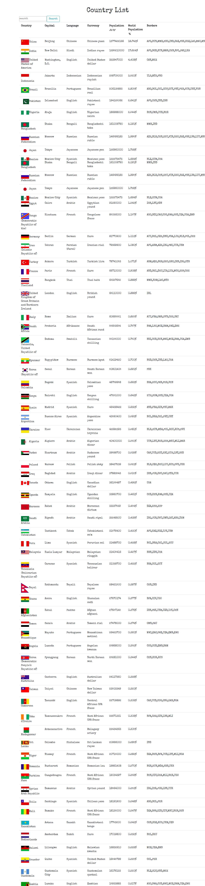

# country-list
Country-List

ApiCall to list all countries with metainfo (capital, language, currency, population, borders & world population). 
Filter, sort & reduce the table by different parameters.
Search on the fly.
ascendant and descendant sorting for the world population
